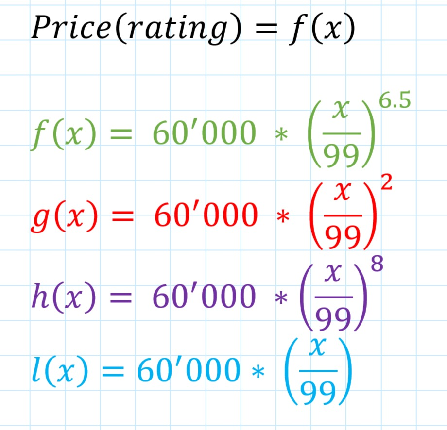
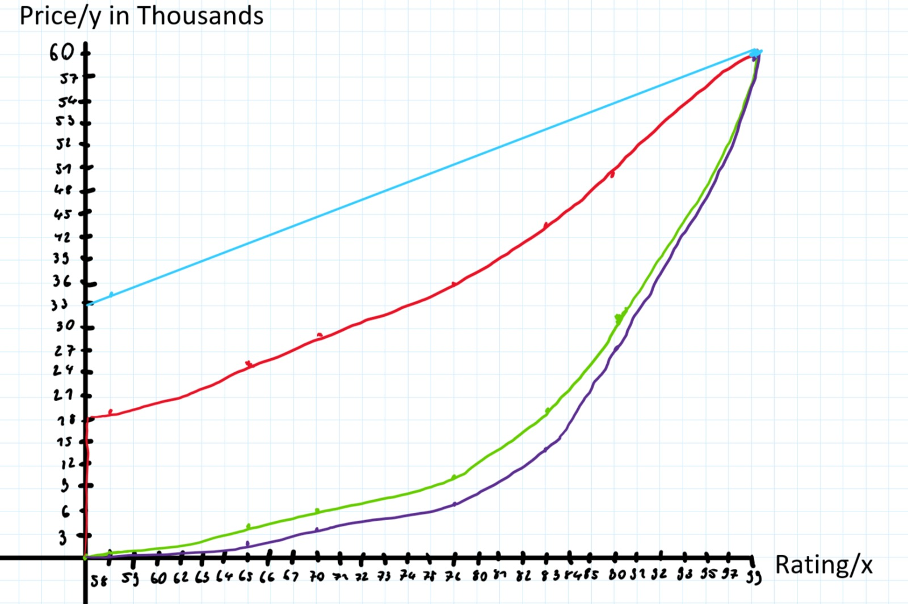

# Football Manager

## Description
The Football Manager is a WPF application with .NET 6.0 and it's object oriented. It is a simulation game where you are the manager and have your own squad. The app provides different operations that you can complete as manager of your team.

## General
The game works with a rating system. The manager has a rating (not in use), the teams have a rating and each player has a rating. On your team, the rating gets determined by the player ratings average. The simulation and the price calculations are all depenedent and based on the rating number.

## Debug Menu
In the apps Main screen, if you double click **UNDER** the button which says "Exit Application" onto the screen, a debug menu will open. In this menu you can see more options like adding money, editing players or resetting the state of the app etc.

## Functions
The first and obvious function is to simulate games. A random opponent gets picked with a random rating which you have to play. Depending on the rating the probability of the winning team is determined by random chance, where the team with a higher rating has a higher chance. Next you can look at stats and information about your players and your team (e.g. Goals, Wins, etc.). You can Manage your team, meaning substituting players from the bench into the starting eleven and vice versa. You can upgrade your players' ratings, where some players have the attribute 'multiupgrade' which is marked by a Ω. There are tiers of upgrades and the players marked with Ω can upgrade up to 10 ratings at once for a price. Other than that theres a shop where you can buy players and packs. There are different packs From Common to Legendary. You have either 5 or 6 players in one pack, but the packs aren't that cheap. You can also sell your players, but for less than buying them.

## Price Calculation
The price of the players is calculated with a power function, so that the price grows exponentially from the lowest rating (58) to the highest (99). The highest possible price was defined at 60'000 coins.
<p align="center">
    
</p>
After trying 4 different functions (see in the image above) I decided to go with f(x). With that the price growth seemed most appropriate. A 58-70 rated player should be cheap and the players that are high rated should cost much more. So l(x) was not an option since 58 rated players already start on around 33'000 Coins. 

## Earning Money
Per every game you play you earn some coins:
- Win: 1500 coins
- Draw: 600 coins
- Loss: 200 coins  
In the beginning you should be able to afford low rated players with that money, then when selling players you can earn more. Selling players reduces the price of the player to an extent. Again this is dependent on the rating, this time calculated with a linear function:
```
f(x) = 1100 + ((rating - 58) / (99 - 58)) * (13000 - 1100)
```
This is the money that gets removed when you sell a player.

## Simulation
The simulation uses the following code to determine the winner of a match:  
```
double ratingDiff = opponentsRating - rating;
int winnerDetection = new Random().Next(100); 
if(winnerDetection > (50 + ratingDiff)) //You win
```
Here you can see that the outcome is somewhat random, but the rating helps the probability.

## Persistence
As method of persistence I knowningly chose JSON. Why? Because it is not a multiplayer game nor does it use any online services. Also serializing data with json onto the machine is quick and easy and gives room for more and faster operations. The path of the json files can be specified at the beginning. The path will be saved in a text file at `C:\Users\username\Documents\Football_Manager_Data`

## Possible improvements (self evaluation)
- Using MVC pattern instead of writing logic into the Views
- In the packs menu, make it possible to send each player into the squad or quick sell each player instead of all at once
- Introduce a database for more flexible persistence
- Avoid so many variable definitions in the View classes
- Use newer Tool for UI design than wpf (e.g. MAUI)
